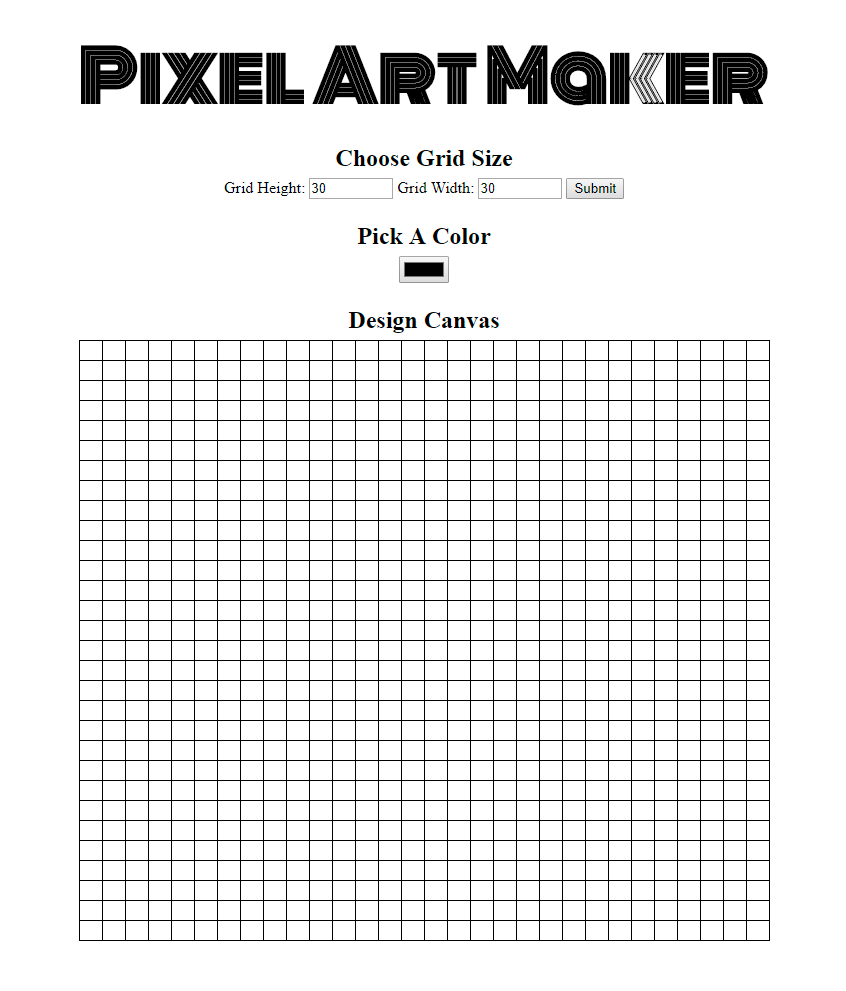

# Udacity pixelArtMaker Project
pixelArtMaker is a single-page web app that allows users to draw pixel art on a customizable canvas.

The users are able to:
- Dynamically set the size of the table as an _N_ by _M_ grid.
- Choose a color.
- Click a cell in the grid to fill that cell with the chosen color.

# The app includes:
- variables with `const` and `let`
- accessing the DOM using methods of the `document` object
- declaring functions and attaching them to DOM objects as event listeners
- nested loops and loop variables

# Screenshot of the page

# External Resources Used
[HTML Style Guide](http://udacity.github.io/frontend-nanodegree-styleguide/index.html)
[CSS Style Guide](http://udacity.github.io/frontend-nanodegree-styleguide/css.html)
[JavaScript Style Guide](http://udacity.github.io/frontend-nanodegree-styleguide/javascript.html)
[Git Style Guide](https://udacity.github.io/git-styleguide/)
[Google Fonts](https://fonts.google.com/)